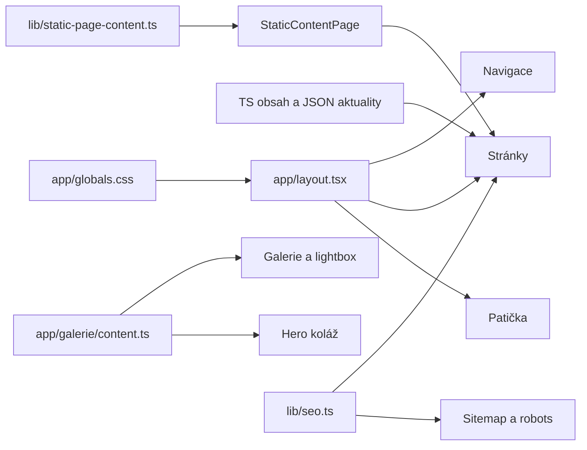

# Vývoj MŠ Tyršovka

Zdrojový stav zdokumentován 2026-09-13. Popis lokální implementace, ne ověřeného produkčního deploymentu.

## Architektura

Next.js App Router má 16 statických cest a šablonu `/aktuality/[slug]`. Layout přidává navigaci, patičku, češtinu a fonty. Serverové stránky čtou obsah importem; interaktivní části mají `use client`. Aplikační zdroje neobsahují vlastní API route, databázového klienta, přihlášení ani CMS. Úprava obsahu vyžaduje změnu zdrojů a nový build/deployment.



Routy a kompozice: [UI.md](UI.md). Texty: [CONTENT.md](CONTENT.md). Obrázky: [ASSETS.md](ASSETS.md).

## Konfigurace

| Soubor | Úloha |
|---|---|
| `package.json` | Dev/build/start/lint; manifest Next 16.3.5, React 19.3.0, TS ^7.0.2, ESLint ^10.10.0. Nejde o nové ověření npm latest. |
| `pnpm-lock.yaml` | Zamčené řešení pnpm, které používá Vercel. |
| `package-lock.json` | Zamčené řešení npm; graf obsahuje jeho tranzitivní vztahy, ne fyzický strom pnpm. |
| `pnpm-workspace.yaml` | allowBuilds: msw, sharp, unrs-resolver; 12 minimumReleaseAgeExclude výjimek pro Next 16.3.5. Při zahájení dokumentace untracked; přítomnost v deploymentu nedoložena. |
| `vercel.json:2` | `pnpm install --no-frozen-lockfile` může přepočítat lockfile; není důkazem deploymentu. |
| `next.config.ts:4` | HTTPS obrázky files.site.site3.eu a raw.githubusercontent.com. |
| `tsconfig.json` | Strict TS, bundler resolution, JSON importy, alias @/*, Next plugin. |
| `eslint.config.mjs` | Next Core Web Vitals/TypeScript presety, ignorování buildů. |
| `postcss.config.mjs` | Tailwind PostCSS plugin. |
| `components.json` | shadcn new-york, RSC/TSX, CSS variables, lucide, registry Aceternity/React Bits. |
| `.gitignore` | Vyloučení instalací, buildů, environment souborů a generovaných typů. |

`cn()` (`lib/utils.ts`) spojuje clsx a tailwind-merge. `lib/button-link-classes.ts` poskytuje serverově bezpečné třídy tlačítek; komentář vysvětluje vyhnutí se volání klientské buttonVariants ze serveru. Při upgradu zachovat konzistenci obou lockfilů, nebo sjednocení řešit samostatně. Graphify/Python není závislost webu.

## SEO a prostředí

`lib/seo.ts:11`: NEXT_PUBLIC_SITE_URL bez koncového lomítka → https + VERCEL_URL → localhost:3000. Produkční hodnoty dodává prostředí; graf environment soubory nečte. Chybějící doména ovlivňuje canonical, Open Graph i sitemap.

`buildPageMetadata()` (`lib/seo.ts:27`) sestavuje canonical/OG/Twitter. Layout přidává title template a favicon. Homepage obsahuje JSON-LD školy, detail JSON-LD článku. Sitemap ručně vypisuje 16 cest a přidává JSON slugs; lastModified je čas generování, nikoli editace. Robots povoluje celý web. Nová stránka vyžaduje kontrolu navigace, metadata a sitemap. Při změně domény kontrolovat i natvrdo zapsané odkazy.

## Místa změn

| Změna | Začátek | Dopady |
|---|---|---|
| Informační text | lib/static-page-content.ts | Markdown, přílohy, routa |
| Aktualita | app/data/aktuality.json | Slug, úvod, seznam, detail, sitemap |
| Album | app/galerie/content.ts | Galerie, lightbox, hero |
| Kontakty/zápisy | app/*/content.ts | Metadata, navigace, duplicity |
| Nová routa | app/<cesta>/page.tsx | Layout, canonical, navigace, sitemap |
| Vzhled | globals.css, layout.tsx | Kontrast, focus, sdílené UI |
| Balíček | Manifest + oba lockfily | Build, lint, interakce |

## Ověřování

```sh
rtk pnpm lint
rtk pnpm build
rtk pnpm exec next build --webpack
rtk git diff --check
```

Webpack je diagnostická alternativa. V předchozím upgradu v této relaci webpack build prošel; lint selhal na kompatibilitě TS 7 s typescript-eslint. Není to nové ověření v dokumentačním kroku. Původní inventář nemá samostatnou testovací sadu ani CI workflow.

Po změně UI ověřit routy, mobilní menu, klávesnici, lightbox, neexistující slug, odkazy, externí obrázky a doménu metadata/sitemap. Návod netvrdí, že tyto kontroly byly právě provedeny. Před změnou hledat spotřebitele v grafu, potom číst skutečné řádky. Obnova: [GRAPH.md](GRAPH.md).
